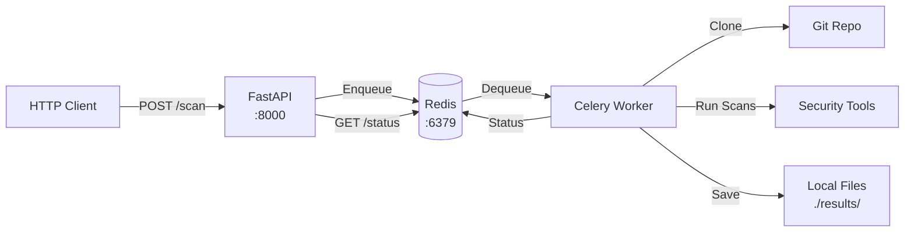

# Security Audit Python Backend - Simple Local Design v0

## Executive Summary

Simple Python backend for running security scans locally. Consists of a FastAPI service and Celery workers. No authentication, no cloud storage, no scalability concerns - just get it working locally.

## Architecture Overview

```
┌─────────────────────────────────────────────────────────────┐
│              FastAPI Service (Local)                         │
│  ┌──────────────┐  ┌──────────────┐  ┌──────────────┐      │
│  │  FastAPI     │  │  Validation  │  │   Queue      │      │
│  │  /scan       │→ │  (Pydantic)  │→ │  (Celery)   │      │
│  │  /status     │  │              │  │             │      │
│  └──────────────┘  └──────────────┘  └──────┬───────┘      │
└──────────────────────────────────────────────┼──────────────┘
                                               │ Redis (Local)
                                               ↓
┌─────────────────────────────────────────────────────────────┐
│         Celery Worker (Single Worker)                       │
│  ┌──────────────────────────────────────────────────────┐  │
│  │  Complete Repository Scan Pipeline                    │  │
│  │  1. Clone Repo → 2. Detect Languages → 3. Run Scans │  │
│  │  4. Store Results → 5. Cleanup                        │  │
│  └──────────────────────────────────────────────────────┘  │
│                    │                                        │
│                    └──────────┬─────────────────────────┘  │
│                               │                            │
│                    ┌──────────▼──────────┐                │
│                    │  Local File Storage  │                │
│                    │  ./results/{scan_id}│                │
│                    └─────────────────────┘                 │
└─────────────────────────────────────────────────────────────┘
```

## System Components

### 1. FastAPI Service

**Purpose**: Simple HTTP API to receive scan requests.

**Key Endpoints:**
- `POST /scan` - Queue a new scan job
- `GET /scan/{scan_id}/status` - Get scan status and results
- `GET /health` - Health check

**No Authentication**: Just accept requests (for local use)

**Technology:**
- FastAPI
- Pydantic for validation
- Celery client

### 2. Celery Worker

**Purpose**: Run security scans.

**Pipeline:**
1. Clone repository to temp directory
2. Detect languages
3. Run applicable scans (SAST, Docker, Terraform, Node, Go, Rust)
4. Store results to local filesystem
5. Cleanup temp directory

**Technology:**
- Celery
- Existing `sec_audit` package (minimal refactoring)

### 3. Redis (Local)

**Purpose**: Task queue.

**Setup:**
- Run locally: `redis-server` or Docker
- Default: `redis://localhost:6379/0`

### 4. Local File Storage

**Purpose**: Store scan results on local filesystem.

**Structure:**
```
results/
  {scan_id}/
    languages.csv
    semgrep.json
    semgrep.txt
    trivy_dockerfile_scan.txt
    node_audit.txt
    go_vulncheck.txt
    rust_audit.txt
    tfsec.txt
    checkov.txt
    tflint.txt
    results.json (aggregated)
```

## Simple Architecture Diagram



## API Specification

### POST /scan

**Request:**
```json
{
  "repo_url": "https://github.com/user/repo.git",
  "branch": "main",
  "audit_types": ["sast", "dockerfile", "terraform", "node", "go", "rust"]
}
```

**Response:**
```json
{
  "scan_id": "abc123",
  "status": "queued"
}
```

### GET /scan/{scan_id}/status

**Response (Running):**
```json
{
  "scan_id": "abc123",
  "status": "running",
  "progress": 50
}
```

**Response (Completed):**
```json
{
  "scan_id": "abc123",
  "status": "completed",
  "results_path": "./results/abc123/"
}
```

**Response (Failed):**
```json
{
  "scan_id": "abc123",
  "status": "failed",
  "error": "Clone failed"
}
```

### GET /health

**Response:**
```json
{
  "status": "ok"
}
```

## Project Structure

```
python-service/
├── api/
│   ├── main.py              # FastAPI app
│   └── models.py            # Pydantic models
├── tasks/
│   └── scan_worker.py       # Celery task
├── sec_audit/               # Existing package (use as-is)
│   ├── scanners.py
│   ├── ecosystem.py
│   ├── repos.py
│   └── fs.py
├── results/                  # Local storage (gitignored)
├── requirements.txt
├── .env                      # Environment variables
└── README.md
```

## Implementation

### FastAPI Service (api/main.py)

```python
from fastapi import FastAPI
from pydantic import BaseModel
from typing import List
from celery import Celery
import uuid

app = FastAPI()

# Simple Celery setup
celery_app = Celery('sec_audit', broker='redis://localhost:6379/0')

class ScanRequest(BaseModel):
    repo_url: str
    branch: str = "main"
    audit_types: List[str]

@app.post("/scan")
async def create_scan(request: ScanRequest):
    scan_id = str(uuid.uuid4())
    celery_app.send_task('tasks.scan_worker.run_scan', args=[scan_id, request.dict()])
    return {"scan_id": scan_id, "status": "queued"}

@app.get("/scan/{scan_id}/status")
async def get_status(scan_id: str):
    task = celery_app.AsyncResult(scan_id)
    return {
        "scan_id": scan_id,
        "status": task.state.lower(),
        "result": task.result if task.ready() else None
    }

@app.get("/health")
async def health():
    return {"status": "ok"}
```

### Celery Worker (tasks/scan_worker.py)

```python
from celery import Celery
import tempfile
from pathlib import Path
from sec_audit.repos import clone_repo, repo_name
from sec_audit.fs import detect_languages
from sec_audit.scanners import run_semgrep, run_trivy_dockerfile_scan, ...
from sec_audit.ecosystem import run_node_audit, run_go_vulncheck, ...

celery_app = Celery('sec_audit', broker='redis://localhost:6379/0')

@celery_app.task(name='tasks.scan_worker.run_scan')
def run_scan(scan_id: str, request_data: dict):
    repo_url = request_data['repo_url']
    branch = request_data.get('branch', 'main')
    audit_types = request_data['audit_types']
    
    results_dir = Path('results') / scan_id
    results_dir.mkdir(parents=True, exist_ok=True)
    
    with tempfile.TemporaryDirectory(prefix=f"scan_{scan_id}_") as tmpdir:
        repo_path = Path(tmpdir) / repo_name(repo_url)
        
        # Clone
        clone_repo(repo_url, repo_path, branch, skip_lfs=False)
        
        # Detect languages
        languages = detect_languages(repo_path)
        # Save languages.csv
        # ...
        
        # Run scans
        if 'sast' in audit_types:
            run_semgrep(repo_path, results_dir / 'semgrep.json', results_dir / 'semgrep.txt')
        
        if 'dockerfile' in audit_types:
            run_trivy_dockerfile_scan(repo_path, repo_name(repo_url), results_dir / 'trivy.txt')
        
        # ... other scans
        
        # Aggregate results
        # Save results.json
        
    return {"status": "completed", "results_path": str(results_dir)}
```

## Setup Instructions

### 1. Install Dependencies

```bash
pip install fastapi uvicorn celery redis pydantic
```

### 2. Start Redis

```bash
# Option 1: Local Redis
redis-server

# Option 2: Docker
docker run -d -p 6379:6379 redis:7-alpine
```

### 3. Start FastAPI Service

```bash
uvicorn api.main:app --reload --port 8000
```

### 4. Start Celery Worker

```bash
celery -A tasks.scan_worker worker --loglevel=info
```

### 5. Test

```bash
# Create scan
curl -X POST http://localhost:8000/scan \
  -H "Content-Type: application/json" \
  -d '{
    "repo_url": "https://github.com/user/repo.git",
    "audit_types": ["sast", "dockerfile"]
  }'

# Check status
curl http://localhost:8000/scan/{scan_id}/status

```

### Example for https://github.com/stoic-one/ns-auth-sdk

```bash
# 1. Create a scan request
curl -X POST http://localhost:8000/scan \
  -H "Content-Type: application/json" \
  -d '{
    "repo_url": "https://github.com/stoic-one/ns-auth-sdk.git",
    "audit_types": ["sast", "dockerfile"]
  }'

# Response:
# {
#   "scan_id": "e7d5a8b1-c3bf-4f02-b4b6-0a24d2611234"
# }

# 2. Check the scan status with the scan_id from above
curl http://localhost:8000/scan/e7d5a8b1-c3bf-4f02-b4b6-0a24d2611234/status

# Possible responses:
# {
#   "status": "pending"
# }
# or
# {
#   "status": "completed",
#   "results_path": "./results/e7d5a8b1-c3bf-4f02-b4b6-0a24d2611234/"
# }
```


## Environment Variables

```bash
# .env file (optional, defaults shown)
REDIS_URL=redis://localhost:6379/0
RESULTS_DIR=./results
```

## Dependencies (requirements.txt)

```txt
fastapi==0.104.1
uvicorn[standard]==0.24.0
celery==5.3.4
redis==5.0.1
pydantic==2.5.0
```

## Key Simplifications

1. **No Authentication**: Just accept requests
2. **Local Storage**: Save to `./results/` directory
3. **Single Worker**: One worker instance (can add more later)
4. **No Database**: Status stored in Redis/Celery only
5. **No S3**: Local filesystem only
6. **Simple Setup**: Just Redis + Python

## Next Steps (Future)

- Add authentication (API keys)
- Add S3 storage
- Add database for metadata
- Add multiple workers
- Add monitoring
- Add error handling improvements

---

**Document Version:** 0.1 (Local Only)  
**Last Updated:** 2025-01-24  
**Focus:** Get it working locally first
