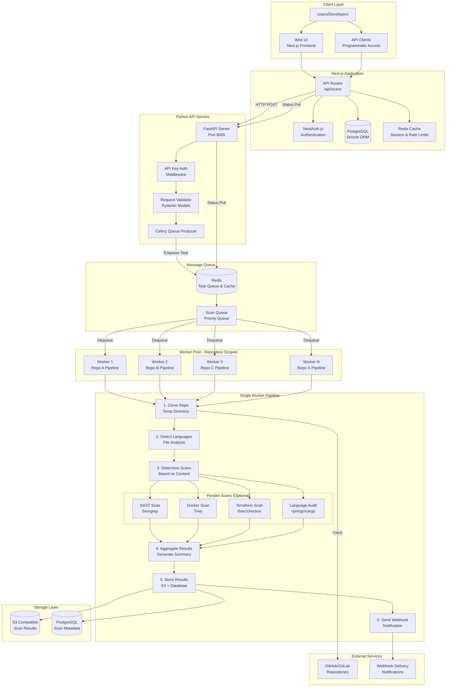
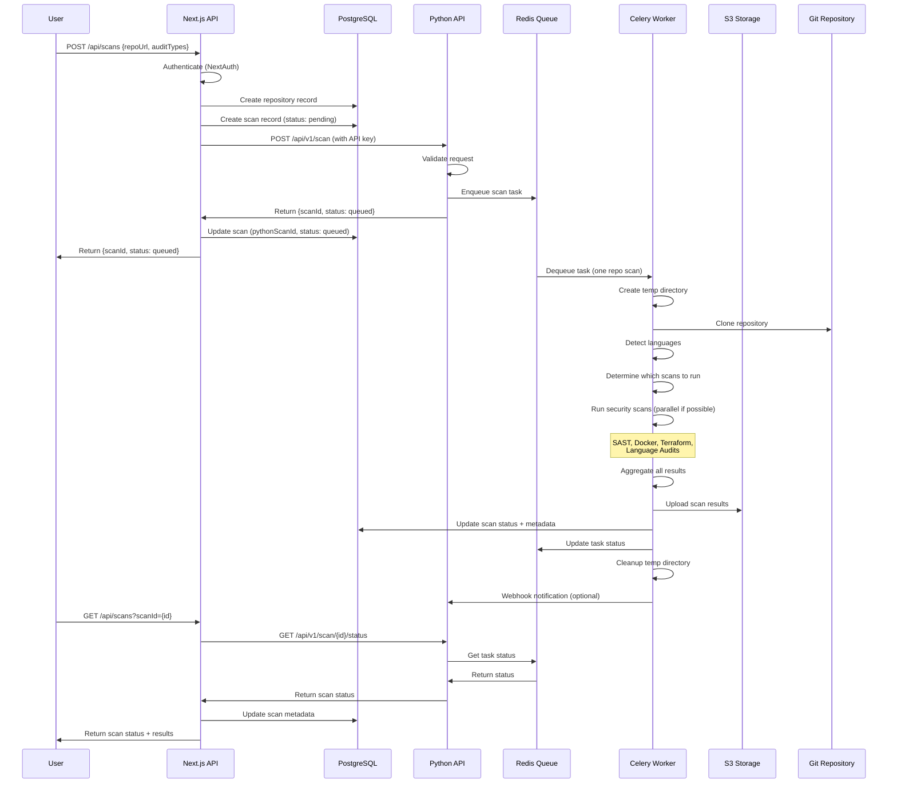

# Security Audit SaaS - Architecture Design Document v1

## Executive Summary

This document outlines the architecture for transforming the `securefast` CLI tool into a scalable SaaS platform. The solution integrates with indie-kit (Next.js frontend + backend API) and implements a microservices architecture with HTTP API integration and a queue-based worker system for asynchronous scan processing.

**Key Architecture Decision**: **Single Worker Per Repository Pipeline** - Each Celery worker handles the complete scan pipeline for one repository (clone → detect → scan → store), ensuring efficiency, consistency, and simplicity. This approach matches the existing CLI implementation and avoids duplicate work.

## System Architecture Overview

### High-Level Architecture

```
┌─────────────────────────────────────────────────────────────────┐
│                    Next.js Application Layer                    │
│                    (Indie-Kit Boilerplate)                      │
│  ┌──────────────┐  ┌──────────────┐  ┌──────────────┐          │
│  │   Frontend   │  │  API Routes  │  │   Database  │          │
│  │  (React UI)  │→ │  /api/scans  │→ │  (Drizzle)   │          │
│  └──────────────┘  └──────┬───────┘  └──────────────┘          │
└───────────────────────────┼────────────────────────────────────┘
                            │ HTTP REST API
                            │ (API Key Auth)
                            ↓
┌─────────────────────────────────────────────────────────────────┐
│           Python FastAPI Service (API Gateway)                   │
│  ┌──────────────┐  ┌──────────────┐  ┌──────────────┐         │
│  │  FastAPI     │  │  Validation  │  │   Queue      │         │
│  │  /scan       │→ │  & Auth      │→ │  Producer    │         │
│  │  /status     │  │              │  │  (Celery)   │         │
│  └──────────────┘  └──────────────┘  └──────┬───────┘         │
└──────────────────────────────────────────────┼──────────────────┘
                                               │ Redis Queue
                                               │ (Task Queue)
                                               ↓
┌─────────────────────────────────────────────────────────────────┐
│         Celery Workers (Repository-Scoped Pipeline)              │
│  ┌──────────────────────────────────────────────────────────┐   │
│  │  Worker 1: Repo A Pipeline                               │   │
│  │  1. Clone Repo → 2. Detect Languages → 3. Run Scans     │   │
│  │  4. Aggregate → 5. Store Results → 6. Cleanup         │   │
│  └──────────────────────────────────────────────────────────┘   │
│  ┌──────────────────────────────────────────────────────────┐   │
│  │  Worker 2: Repo B Pipeline                               │   │
│  │  1. Clone Repo → 2. Detect Languages → 3. Run Scans     │   │
│  │  4. Aggregate → 5. Store Results → 6. Cleanup         │   │
│  └──────────────────────────────────────────────────────────┘   │
│  ┌──────────────────────────────────────────────────────────┐   │
│  │  Worker N: Repo X Pipeline                               │   │
│  │  1. Clone Repo → 2. Detect Languages → 3. Run Scans     │   │
│  │  4. Aggregate → 5. Store Results → 6. Cleanup         │   │
│  └──────────────────────────────────────────────────────────┘   │
│                    │                                    │        │
│                    └──────────┬─────────────────────────┘        │
│                               │                                  │
│                    ┌──────────▼──────────┐                      │
│                    │  Result Storage      │                      │
│                    │  (S3 + Database)    │                      │
│                    └─────────────────────┘                       │
└─────────────────────────────────────────────────────────────────┘
```

## Complete System Architecture Diagram



## Framework and Technology Decisions

### 1. Frontend & Backend Framework

**Decision: Next.js (Indie-Kit Boilerplate)**
- **Rationale:**
  - Full-stack framework with built-in API routes
  - Built-in authentication (NextAuth.js)
  - TypeScript support for type safety
  - Server-side rendering and static generation
  - Modern App Router architecture
- **Key Components:**
  - Frontend: React 19 with Next.js App Router
  - API Routes: Route handlers in `/app/api`
  - Database: Drizzle ORM (PostgreSQL)
  - Authentication: NextAuth.js with multiple providers

### 2. Python API Service

**Decision: FastAPI**
- **Rationale:**
  - High-performance async framework
  - Automatic OpenAPI documentation
  - Type validation with Pydantic
  - Easy integration with async task queues
  - Python ecosystem compatibility for security tools
- **Responsibilities:**
  - API gateway for scan requests
  - Request validation and authentication
  - Queue job creation
  - Status polling endpoint
  - Health checks

### 3. Task Queue System

**Decision: Celery with Redis**
- **Rationale:**
  - Mature Python task queue framework
  - Redis as broker (fast, simple setup)
  - Horizontal scaling capabilities
  - Task prioritization support
  - Built-in retry mechanisms
  - Progress tracking capabilities
- **Configuration:**
  - Broker: Redis
  - Result backend: Redis
  - Task serialization: JSON
  - Worker pools: Single queue (`scans`) - all workers identical
  - Concurrency: 2-4 workers per instance (configurable)
  - Task routing: One task = one repository scan (complete pipeline)

### 4. Database Decisions

**Decision: PostgreSQL (Primary) + Redis (Cache/Queue)**
- **PostgreSQL (via Drizzle ORM):**
  - Stores: Organizations, users, repositories, scans metadata, webhooks
  - Rationale: ACID compliance, complex queries, relationships
  - Managed options: Supabase, Neon, Railway
- **Redis:**
  - Stores: Task queue, session cache, rate limiting, scan status
  - Rationale: Low latency, pub/sub, TTL support
  - Managed options: Upstash, Redis Cloud, AWS ElastiCache

### 5. Object Storage

**Decision: S3-Compatible Storage**
- **Rationale:**
  - Scalable storage for scan artifacts
  - Cost-effective for large files
  - Lifecycle policies for cleanup
  - Pre-signed URLs for secure access
- **Options:**
  - AWS S3 (production)
  - MinIO (self-hosted)
  - Cloudflare R2 (alternative)
  - Backblaze B2 (cost-effective)

### 6. Authentication Strategy

**Decision: Multi-Layer Authentication**
- **Next.js Layer (NextAuth.js):**
  - User authentication: OAuth (Google, GitHub), Magic Link
  - Session management: JWT tokens
  - Organization-based access control
- **Python API Layer:**
  - API key authentication (shared secret)
  - Header: `X-API-Key`
  - Validates on every request
- **Rationale:**
  - Separation of concerns
  - API keys for service-to-service communication
  - User sessions for web UI

### 7. Containerization & Deployment

**Decision: Docker + Docker Compose (Dev) / Kubernetes (Prod)**
- **Containerization:**
  - Separate containers for each service
  - Multi-stage builds for optimization
  - Docker-in-Docker for scan workers (Dockerfile scans)
- **Development:**
  - Docker Compose for local orchestration
  - Hot reload for Next.js
  - Volume mounts for development
- **Production:**
  - Kubernetes for orchestration (recommended)
  - Horizontal pod autoscaling
  - Separate deployments per service

## Component Architecture

### Component 1: Next.js Application (Indie-Kit)

**Responsibilities:**
- User interface and authentication
- Business logic and authorization
- Database operations (repositories, scans, organizations)
- API route handlers for scan management
- Rate limiting and quotas

**Key Endpoints:**
- `POST /api/scans` - Create scan job
- `GET /api/scans?scanId={id}` - Get scan status
- `GET /api/repositories` - List repositories
- `POST /api/repositories` - Register repository
- `GET /api/scans/{scanId}/results` - Get scan results

**Framework Stack:**
- Next.js 14+ (App Router)
- React 19
- Drizzle ORM
- NextAuth.js
- TypeScript

### Component 2: Python FastAPI Service

**Responsibilities:**
- API gateway for scan operations
- Request validation
- Queue job creation
- Status polling
- Health monitoring

**Key Endpoints:**
- `POST /api/v1/scan` - Queue scan job
- `GET /api/v1/scan/{scanId}/status` - Get scan status
- `GET /api/v1/health` - Health check

**Framework Stack:**
- FastAPI
- Pydantic (validation)
- Celery (task queue client)
- Python 3.11+

### Component 3: Celery Workers (Repository-Scoped Pipeline)

**Architecture: Single Worker Per Repository**

Each worker handles the complete pipeline for one repository scan. This approach ensures:
- **Efficiency**: Clone repository once, detect languages once
- **Consistency**: All scans use the same codebase version
- **Simplicity**: One task = one repository = atomic results
- **Resource Optimization**: Better disk/memory usage

**Pipeline Steps (Sequential):**
1. **Clone Repository** → Create temporary directory, clone repo, update submodules
2. **Detect Languages** → Analyze repository to identify programming languages
3. **Determine Scans** → Based on detected languages and requested audit types
4. **Execute Scans** → Run applicable security scans (can be parallelized within worker)
   - SAST (Semgrep)
   - Dockerfile (Trivy)
   - Terraform (tfsec, checkov, tflint)
   - Language Audits (npm/pnpm, govulncheck, cargo-audit)
5. **Aggregate Results** → Combine all scan results, generate summary
6. **Store Results** → Upload to S3, update database metadata
7. **Send Webhook** → Notify completion (if configured)
8. **Cleanup** → Delete temporary directory

**Worker Configuration:**
- All workers are identical (no specialization needed)
- Queue: Single `scans` queue
- Task: `scan_repository(scan_id, repo_url, branch, audit_types)`
- Priority: High priority for paid plans
- Concurrency: 2-4 concurrent tasks per worker instance

**Framework Stack:**
- Celery 5.3+
- Python 3.11+
- Existing `sec_audit` package (refactored for pipeline)

### Component 4: Message Queue (Redis)

**Responsibilities:**
- Task queue broker
- Result backend
- Cache for scan status
- Rate limiting counters
- Session storage (Next.js)

**Configuration:**
- Redis 7+ (recommended)
- Persistence enabled for production
- Cluster mode for high availability

### Component 5: Storage Layer

**PostgreSQL (Drizzle ORM):**
- Tables: `organizations`, `users`, `repositories`, `scans`, `scan_results`, `webhooks`
- Relationships: Foreign keys with cascade deletes
- Indexes: On `scan_id`, `repository_id`, `organization_id`

**S3-Compatible Storage:**
- Structure: `scans/{scanId}/{auditType}/{filename}`
- Lifecycle: Delete after 90 days (configurable)
- Access: Pre-signed URLs (15-minute expiry)

## Data Flow Architecture

### Scan Request Flow



## Scalability Considerations

### Horizontal Scaling Strategy

1. **Next.js Application**
   - Stateless API routes
   - Scale: Multiple instances behind load balancer
   - Session storage: Redis (shared)
   - Database: Connection pooling (PgBouncer)

2. **Python FastAPI Service**
   - Stateless API gateway
   - Scale: Multiple instances behind load balancer
   - API key validation: Shared secret (no state)

3. **Celery Workers**
   - Stateless workers (ephemeral temp directories)
   - Scale: Add workers based on queue depth
   - Auto-scaling: Based on queue length
   - Resource limits: CPU/memory per worker
   - All workers identical: No specialization needed
   - One worker = one repository scan (complete pipeline)

4. **Redis**
   - Cluster mode for high availability
   - Read replicas for scaling reads
   - Persistence: AOF + RDB snapshots

5. **PostgreSQL**
   - Read replicas for scaling reads
   - Connection pooling: PgBouncer
   - Managed service: Automatic backups and scaling

### Performance Optimizations

1. **Caching Strategy**
   - Redis: Scan status (TTL: 5 minutes)
   - Redis: Scan results summary (TTL: 1 hour)
   - Next.js: Static generation for public pages
   - CDN: Static assets (Cloudflare/CloudFront)

2. **Database Optimizations**
   - Indexes: On `scan_id`, `repository_id`, `organization_id`, `status`
   - Query optimization: Use Drizzle query builder
   - Connection pooling: Max 20 connections per instance

3. **Queue Optimizations**
   - Priority queues: Paid plans get higher priority
   - Worker prefetch: Set to 1 for fair distribution
   - Task routing: One task per repository (complete pipeline)
   - Parallel scans: Optional parallelization within worker (ThreadPoolExecutor)

## Security Architecture

### Security Layers

1. **Authentication & Authorization**
   - Next.js: NextAuth.js (OAuth, Magic Link)
   - API: API key validation
   - Database: Row-level security (organization isolation)

2. **Network Security**
   - API: HTTPS only (TLS 1.2+)
   - Internal communication: Private network (VPC)
   - Workers: No public internet access (except for Git clones)

3. **Data Security**
   - Secrets: Environment variables (not in code)
   - API keys: Stored hashed in database
   - S3: Pre-signed URLs with short expiry
   - Database: Encrypted at rest

4. **Isolation**
   - Workers: Ephemeral filesystem (temp directories per repository)
   - One worker handles one repository (complete isolation)
   - Resource limits: CPU/memory per worker
   - Cleanup: Automatic temp directory deletion after scan

5. **Input Validation**
   - Next.js: Zod schema validation
   - Python: Pydantic models
   - Sanitization: Repository URLs, branch names

## Deployment Architecture

### Development Environment

```
┌─────────────────────────────────────────────────┐
│         Docker Compose (Local Dev)               │
│  ┌──────────┐  ┌──────────┐  ┌──────────┐      │
│  │  Next.js │  │ FastAPI  │  │  Redis   │      │
│  │  :3000   │  │  :8000   │  │  :6379   │      │
│  └──────────┘  └──────────┘  └──────────┘      │
│  ┌──────────┐  ┌──────────┐                    │
│  │ Celery   │  │ Postgres │                    │
│  │ Workers  │  │  :5432   │                    │
│  └──────────┘  └──────────┘                    │
└─────────────────────────────────────────────────┘
```

### Production Environment

```
┌─────────────────────────────────────────────────────┐
│              Cloud Load Balancer                     │
│  ┌──────────────────────────────────────────────┐   │
│  │        Next.js Instances (3+)                 │   │
│  │  ┌────────┐  ┌────────┐  ┌────────┐         │   │
│  │  │ Next 1 │  │ Next 2 │  │ Next 3 │         │   │
│  │  └────────┘  └────────┘  └────────┘         │   │
│  └──────────────────────────────────────────────┘   │
│  ┌──────────────────────────────────────────────┐   │
│  │     FastAPI Instances (2+)                     │   │
│  │  ┌────────┐  ┌────────┐                      │   │
│  │  │ API 1  │  │ API 2  │                      │   │
│  │  └────────┘  └────────┘                      │   │
│  └──────────────────────────────────────────────┘   │
│  ┌──────────────────────────────────────────────┐   │
│  │     Celery Worker Pool (Auto-scaling)          │   │
│  │  ┌────────┐  ┌────────┐  ┌────────┐         │   │
│  │  │Worker 1│  │Worker 2│  │Worker N│         │   │
│  │  └────────┘  └────────┘  └────────┘         │   │
│  └──────────────────────────────────────────────┘   │
│  ┌──────────────────────────────────────────────┐   │
│  │     Managed Services                          │   │
│  │  ┌────────┐  ┌────────┐  ┌────────┐         │   │
│  │  │Postgres│  │ Redis  │  │   S3   │         │   │
│  │  │Cluster │  │Cluster │  │ Bucket │         │   │
│  │  └────────┘  └────────┘  └────────┘         │   │
│  └──────────────────────────────────────────────┘   │
└─────────────────────────────────────────────────────┘
```

## Technology Stack Summary

| Component | Technology | Rationale |
|-----------|-----------|-----------|
| **Frontend** | Next.js 14+ (App Router) | Full-stack framework, SSR, API routes |
| **Backend API** | Next.js API Routes | Integrated with frontend, type-safe |
| **Python API** | FastAPI | Fast async, OpenAPI docs, validation |
| **Task Queue** | Celery + Redis | Proven Python task queue, scalable |
| **Database** | PostgreSQL + Drizzle ORM | ACID, relationships, type-safe queries |
| **Cache/Queue** | Redis 7+ | Fast, pub/sub, TTL support |
| **Storage** | S3-Compatible | Scalable, cost-effective, lifecycle policies |
| **Auth** | NextAuth.js + API Keys | Multi-provider auth, secure sessions |
| **Containerization** | Docker | Consistent environments, easy deployment |
| **Orchestration** | Kubernetes (Prod) | Auto-scaling, high availability |

## Worker Architecture: Single Worker Per Repository Pipeline

### Design Decision: Repository-Scoped Workers

**Why Single Worker Per Repository?**

Based on the existing `sec_audit` codebase analysis, the optimal architecture is to have each worker handle the complete pipeline for one repository. This matches the current CLI implementation where:

1. **One Clone Per Repository**: The code clones each repository once (line 104 in `cli.py`)
2. **Language Detection Once**: Languages are detected once per repository (line 108)
3. **Multiple Scans on Same Repo**: All scans run on the same cloned repository
4. **Atomic Results**: All results are stored together for one repository

### Benefits

1. **Efficiency**
   - Clone repository once (not per scan type)
   - Language detection once (shared across all scans)
   - Shared filesystem access for all scans
   - No duplicate work or coordination overhead

2. **Simplicity**
   - One task = one repository scan
   - Easier error handling (atomic operation)
   - Simpler progress tracking
   - Matches existing code structure

3. **Resource Optimization**
   - Better disk space usage (one clone per repo)
   - Better memory usage (shared context)
   - Faster overall execution (no coordination overhead)
   - Cleaner resource cleanup

4. **Data Consistency**
   - All scans use the same codebase version
   - Results are consistent and correlated
   - Easier to aggregate findings

### Pipeline Flow

```
┌─────────────────────────────────────────────────────────────┐
│              Celery Worker (Repository-Scoped)                │
│                                                               │
│  Pipeline Steps (Sequential):                                │
│  1. Clone Repository → Temp Directory                        │
│  2. Update Submodules                                        │
│  3. Detect Languages                                         │
│  4. Determine Which Scans to Run                            │
│                                                               │
│  Scan Execution (Can be Parallel):                          │
│  ┌──────────┐  ┌──────────┐  ┌──────────┐  ┌──────────┐   │
│  │  SAST    │  │ Docker   │  │Terraform │  │Language │   │
│  │ Semgrep  │  │  Trivy   │  │ tfsec    │  │ Audits  │   │
│  │          │  │          │  │ checkov  │  │ npm/go  │   │
│  └──────────┘  └──────────┘  └──────────┘  └──────────┘   │
│       │             │             │             │           │
│       └─────────────┼─────────────┼─────────────┘           │
│                     │             │                          │
│              ┌──────▼─────────────▼──────┐                  │
│              │   Aggregate Results         │                  │
│              │   Generate Summary         │                  │
│              └──────┬─────────────┬──────┘                  │
│                     │             │                          │
│              ┌──────▼─────────────▼──────┐                  │
│              │   Store in S3              │                  │
│              │   Update Database          │                  │
│              │   Send Webhook             │                  │
│              └───────────────────────────┘                  │
│                                                               │
│  Cleanup: Delete Temp Directory                              │
└─────────────────────────────────────────────────────────────┘
```

### Implementation Strategy

**Option 1: Sequential Scans (Simpler, Matches Current Code)**
- Run scans one after another
- Simpler error handling
- Lower memory usage
- Matches existing `cli.py` implementation

**Option 2: Parallel Scans (Faster, More Complex)**
- Run independent scans in parallel using ThreadPoolExecutor
- Faster overall execution
- Higher memory usage
- Requires careful error handling

**Recommendation**: Start with Option 1 (sequential), optimize to Option 2 if needed.

### Worker Scaling

- **Horizontal Scaling**: Add more identical workers
- **No Specialization**: All workers can handle any repository
- **Auto-scaling**: Based on queue depth
- **Resource Limits**: Per worker (CPU/memory)

## Key Design Principles

1. **Separation of Concerns**
   - Next.js: User-facing, business logic
   - Python: Scan execution, security tools
   - Clear API boundaries

2. **Scalability**
   - Stateless services (except database)
   - Horizontal scaling
   - Queue-based processing
   - Auto-scaling based on load

3. **Reliability**
   - Retry mechanisms (Celery)
   - Error handling and logging
   - Health checks
   - Database backups

4. **Security**
   - Multi-layer authentication
   - Input validation
   - Isolation (workers in containers)
   - Encrypted storage

5. **Performance**
   - Caching (Redis, CDN)
   - Async processing (queue)
   - Database optimization (indexes, pooling)
   - Efficient storage (S3)

## Next Steps

1. **Phase 1: Foundation (Weeks 1-2)**
   - Set up Next.js project structure
   - Create database schema (Drizzle)
   - Implement basic API routes
   - Set up FastAPI service skeleton

2. **Phase 2: Queue Integration (Weeks 3-4)**
   - Integrate Celery with Redis
   - Refactor scan logic into Celery tasks
   - Implement status polling
   - Add S3 storage integration

3. **Phase 3: Multi-tenancy (Week 5)**
   - Add organization/user models
   - Implement RBAC
   - Add organization isolation

4. **Phase 4: Production Features (Weeks 6-8)**
   - Rate limiting and quotas
   - Webhooks
   - Monitoring and logging
   - Error handling and retries

5. **Phase 5: Scale & Optimize (Ongoing)**
   - Performance optimization
   - Auto-scaling configuration
   - Monitoring dashboards
   - Cost optimization

---

**Document Version:** 1.0  
**Last Updated:** 2025-01-24  
**Author:** Architecture Team
